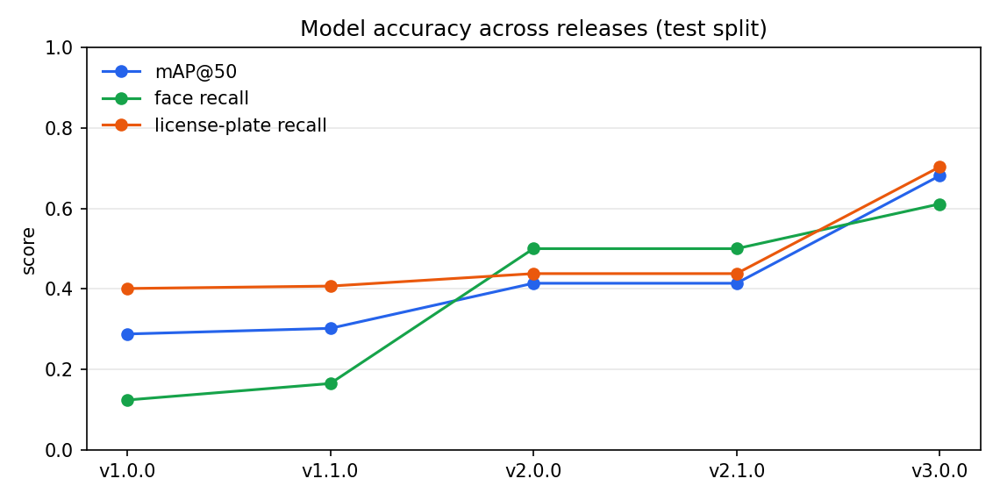

# Model Card — YOLO26 Face & License-Plate Detector

A human-readable description of **what this model detects, how it was trained, and on
what kind of data** — written so a person (not a machine) can understand and reproduce
the setup. No images, annotations, API keys, or server credentials are part of this
repository (privacy by design).

> **Version `v3.0.0`** (Sprint 3) — YOLO26 **medium** (`yolo26m`), trained on 1280×1280
> tiles down-scaled to 640 px. Infer at `imgsz=640`. Retrained on a substantially larger,
> merged dataset via the generic `toolkit/` pipeline — **mAP50 0.414 → 0.681**, see §7.

---

## 1. What the model does

| | |
|---|---|
| **Architecture** | YOLO26 **medium** (`yolo26m`) |
| **Purpose** | Locate **faces** and **vehicle license-plates** in photos so they can be anonymized (blurred) automatically on upload |
| **Project** | Part of *"Privacy by Upload — Automated Image Anonymization"* (HTW Berlin, in collaboration with Parry) |
| **Framework** | [Ultralytics](https://docs.ultralytics.com) `8.4.70`, PyTorch `2.1.2` (CUDA) |

### Classes / labels

The model outputs exactly **two** classes. The class **index is the integer** in the
detection output; the **name** is what it means:

| Index | Label | Meaning |
|------:|-------|---------|
| `0` | `face` | A human face (any orientation typical for street imagery) |
| `1` | `license-plate` | A vehicle registration plate |

> The underlying annotation export contains more object categories (car, person,
> truck, …). For this model **all other categories were deliberately dropped** — only
> `face` and `license-plate` are trained. Tiles that contained *only* other objects are
> kept as **hard-negative backgrounds** (they teach the model *not* to fire on cars or
> people), at roughly a 12–13 % background ratio.

---

## 2. Recommended inference settings

| Property | Value | Why |
|---|---|---|
| **`imgsz`** | **640** | The model was trained on 1280 px tiles down-scaled to 640 px |
| **conf `face`** | **0.222** | Balanced: highest F1 (precision & recall together) |
| **conf `license-plate`** | **0.263** | Balanced: highest F1 |
| **Color** | RGB | |

The per-class thresholds are chosen for the **highest F1 score** (precision and recall
maximized together) on the test set. For anonymisation, where a missed face/plate is a
privacy leak, consumers may prefer to lower these further to trade precision for recall.
They ship in the release `.env` as `CONF_THRESHOLDS` (`index:conf`, parallel to `CLASSES`)
and are logged for every training run in `runs/best_conf_log.csv`.

---

## 3. Input / tiling / compression

| Property | Value | Why |
|---|---|---|
| **Source tile size** | **1280 × 1280 px** | Lossless crop keeps small objects sharp |
| **Compression** | **downscale to 640 px** | Halves training/inference cost, still enough resolution for the target objects |
| **Model input (`imgsz`)** | **640** | Post-downscale tile size |

Full-resolution source photos are first **cropped into 1280×1280 tiles**, then down-scaled
to 640 px for training/inference — so a tiny license-plate is captured at full resolution
before the resize, rather than being shrunk directly out of a much larger source photo.

---

## 4. How the data was prepared

The config-driven `toolkit/` pipeline (`toolkit/run.py {check,build,find-batch,train}`)
turns a registry of annotated datasets into a training set:

1. **Per-dataset split**: every registered dataset is split **train / val** (85 / 15, no
   test split) **per source image** (stable hash — no leakage) *before* any tiling or
   augmentation, then the splits of all datasets are **merged**.
2. **Annotation-aware tiling**: source photos are cropped into lossless **1280×1280**
   tiles placed so every annotated object is fully covered; a fixed-window regime also
   teaches realistic camera/screen aspect ratios. Train-only.
3. **Augmentation + auto class-balance**: pixel-level variants (rotate/flip/exposure/
   noise/blur) plus automatic **oversampling of the weaker class** (measured on the
   merged train split, capped at 5 versions of any one source image).
4. **2-class reduction**: labels reduced to `face` / `license-plate` + a hard-negative
   background ratio → the built dataset this model was trained on.
5. **Down-scale**: 1280 px tiles are down-scaled to the model's **640 px** input.

> **No source images, labels, or dataset names are published.** Only the resulting model
> weights are shared, under AGPL-3.0. (Some training data comes from additional annotated
> sources beyond the project's own photos; per the project's privacy policy, external
> dataset identities are not disclosed in this public repository.)

---

## 5. How the model was trained

Config-driven (`toolkit/config/global.yaml`); run via `python toolkit/run.py train`.
Training is **two-phase and automatic**: a **coarse** phase until early stop, then an
**automatic fine-tune** of the best checkpoint, warm-started from the previous release's
best checkpoint rather than from scratch.

| Hyper-parameter | Value |
|---|---|
| Model | YOLO26m (warm-started from the `v2.1.1` checkpoint) |
| Image size (`imgsz`) | 640 (1280 px tiles down-scaled) |
| Coarse phase | up to 400 epochs, early-stop `patience=50` |
| Fine-tune phase | **75 epochs** from the coarse `best.pt`, `lr0=0.005`, cosine tail |
| Batch size | **measured under real DDP** by the batch-finder, self-lowering VRAM ladder |
| Optimizer | SGD, `lr0=0.01` (coarse), momentum `0.937`, weight-decay `5e-4`, cosine LR, AMP |
| Augmentation | `fliplr=0.5`, **`flipud=0.0`**, `degrees=10`, `scale=0.3` (coarse) / `0.1` (fine-tune), `translate=0.1`, `shear=2`, `perspective=2e-4`; **mosaic/mixup/copy_paste off**; HSV `0.015/0.7/0.4` |
| Hardware | NVIDIA GPU node (DDP across all visible GPUs) |

> **This is still a BASE model**, but trained on a substantially **expanded dataset**
> compared to `v2.1.1` (the project's own photos plus additional annotated sources — see
> §4). The plan is to keep expanding the dataset and retraining. See §7 for the metric
> improvements and why the acceptance targets are not all met yet.

### The batch-finder + self-healing training (why it matters)

The batch size is determined by a **real VRAM probe** (`toolkit/src/batch_finder.py`) that
runs genuine passes **under real multi-GPU DDP** at increasing per-GPU sizes and keeps the
largest that does not run out of memory — so the result already accounts for DDP overhead
(single-GPU probing over-promises and OOMs). If real training later still hits a genuine
out-of-memory (a short probe sample can miss a rare dense-object batch), a watchdog
automatically **lowers the VRAM ladder and re-probes** — no manual intervention needed —
and a matching Windows-side watchdog can resume the JupyterHub server itself if the whole
pod gets culled mid-training.

---

## 6. Acceptance criteria (target metrics)

Evaluated on the independent **test** split. *In case of doubt, recall is prioritised over
precision* — a missed face/plate (privacy leak) is worse than an extra blur.

| Category | Min. Recall | Min. Precision |
|---|---|---|
| `face` | ≥ 0.95 | ≥ 0.85 |
| `license-plate` | ≥ 0.90 (MVP) / ≥ 0.98 (production goal) | ≥ 0.90 |

---

## 7. Results

<!-- RESULTS:BEGIN -->
Model **v3.0.0** (`yolo26m` @ 640, Sprint 3), evaluated on the independent **test** split:

| Class | Precision | Recall | AP@50 | AP@50-95 |
|---|---|---|---|---|
| `face` | 0.765 | 0.611 | — | — |
| `license-plate` | 0.924 | 0.703 | — | — |
| **overall (mAP)** | | | **0.681** | **0.361** |

**Target check: `license-plate` precision PASS (0.924 ≥ 0.90); recall close (0.703 <
0.90). `face` PARTIAL** (recall 0.611 < 0.95, precision 0.765 < 0.85). Both classes
improved substantially over `v2.1.1` on a much larger, merged dataset — the next iteration
will keep expanding annotated coverage (especially faces) to close the remaining gap. P/R
are reported at the evaluation confidence; at inference use the **per-class thresholds** in
§2 (face 0.222 / plate 0.263), or lower them further, to trade precision for recall.

*(Compared to v2.1.1 — yolo26m @ 640: face R 0.500→**0.611**, P 0.503→**0.765**;
plate R 0.438→**0.703**, P 0.538→**0.924**; mAP50 0.414→**0.681**, mAP50-95
0.220→**0.361**.)*

**Accuracy across every release** (see `metrics/metrics_history.csv`,
`metrics/plot_history.py`):

<!-- RESULTS:END -->

---

## 8. License & intended use

- **License:** AGPL-3.0 (this code and the trained weights). YOLO26/Ultralytics is
  itself AGPL-3.0; this repository exists to fulfil that share-alike obligation by
  publishing the training code and the resulting model.
- **Intended use:** automated anonymisation (blurring) of faces and license-plates.
- **Not intended for:** identification, tracking, or any surveillance use.
